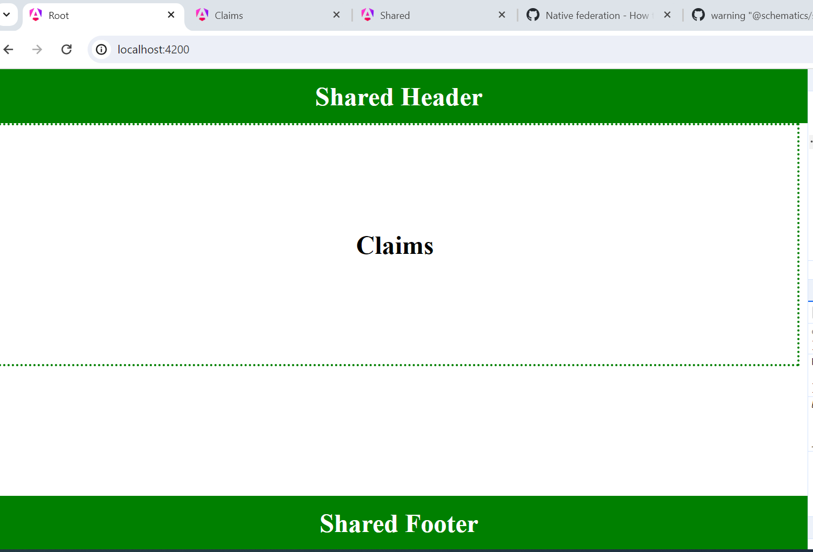
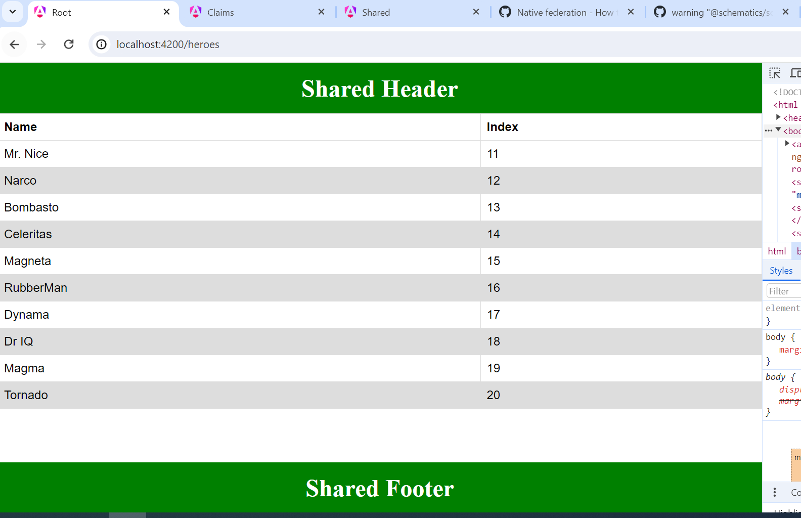

## Relationship with Claim project
It is consuming claims route from the remote claim MFE app. It is reflected on default route:

## Relationship with Shared project:

### Getting Components from  Shared project:
This project is getting header and footer components from shared project. The header component is a standalone component and the foooter is a regular Angular component
, so this demonstration covers both scenarios.

### Getting Servoce from  Shared project:
This project is getting the "testService" from shared MFE app too, you can visualize the implementation on table-component. This is reflected on the "/heroes" route:

